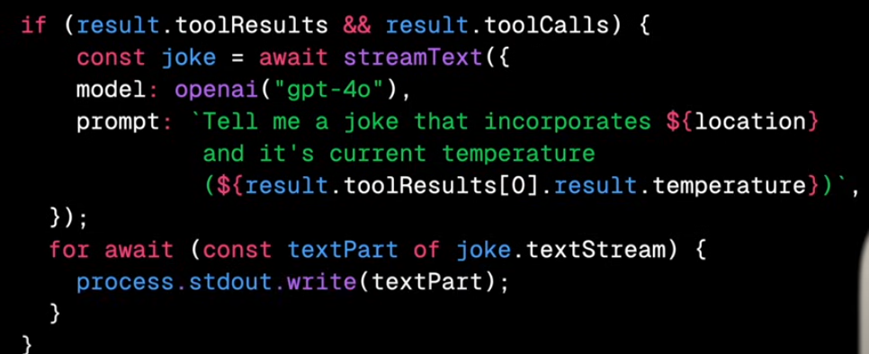

```ts
import { openai } from "@ai-sdk/openai";
import { generateText } from "ai";

async function main() {
    const result = await generateText({
        model: openai("gpt-4o"),
        prompt: "Tell me a joke",
    })

    console.log("result.text");
}

// streamText

for await (const textPart of result.textStream) {
    process.stdout.write(textPart);
}

// structure response

const result = await generateObject({
    model: openai("gpt-4o"),
    prompt: "",
    schema: z.object({
        setup: z.string().describe("the setup of the joke"),
        punchline: z.string().describe("the punchline of the joke")
    }),
});

for await (const partialObject of result.partialObjectStream) {
    console.clear();
    console.log(partialObject);
}


const location="london"
const result = await generateText({
    model" openai("gpt-4o"),
    prompt: `You are funny. users location: ${location}`,
    tools: {
        weather: {
            description: "get the weather for the user's location",
            parameters: z.object({
                location: z.string().describe("user's location"),
            }),
            execute: async ({location}) => {
                const temp = randomnum;
                return temp;
            },
        },
    },
});

```

